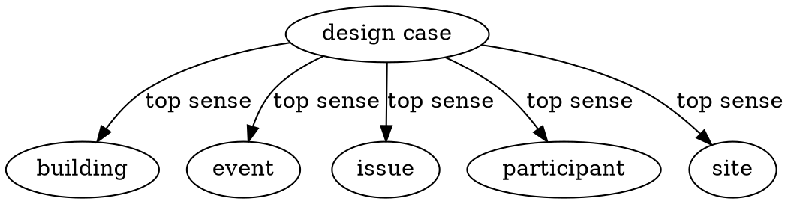
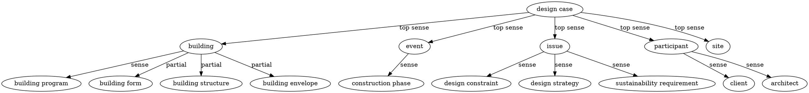

# LLM案例知識本體生成

本模塊是整個本體架構系統的第一步，負責從種子本體開始，透過 LLM 逐步生成和擴展建築案例知識本體。
---
## 資料準備

### 種子本體 (Seed Ontology)

首次運行需要一個預先定義的上層本體 `sense.dot`，表示案例知識應涵蓋的基礎內容。

**預設初始種子本體：**


首輪生成的本體結果自動成為下一輪運行的種子本體，以此循環迭代。

---

## 如何運行

### 基本使用

```Bash
python Generator.py prompt/sense.dot
```
### 範例結果

#### 第一輪生成範例

**輸入（種子本體）：**


**輸出（本體生成結果）：**

---

## 相關檔案

- [Generator.py](Generator.py) - 本體生成模塊 + 本體監督模塊的執行
- [generator_prompt.py](prompt/generator_prompt.py) - 生成模組的 prompt 設計
- [refiner_prompt.py](prompt/refiner_prompt.py) - 監督模組的 prompt 設計
- [sense.dot](prompt/sense.dot) - 預設種子本體

