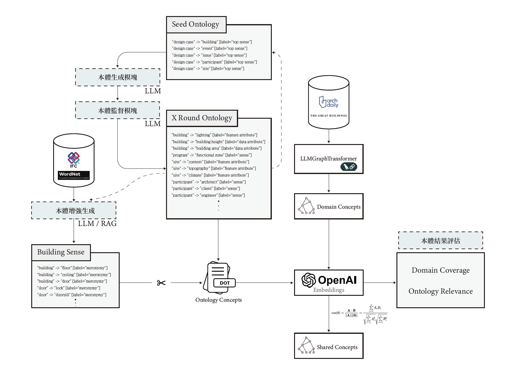

<div align="center">

# LLM 建築本體架構系統 🏗️

</div>

[](https://www.python.org/)
[](https://opensource.org/licenses/MIT)

---

## ⚀ 目錄
- [項目簡介](#-項目簡介)
- [流程介紹](#-流程介紹)
  - [流程(一) 01_Ontology_Generator](01_Ontology_Generator/README.md)
  - [流程(二) 02_Ontology_Augment](02_Ontology_Augment/README.md)
  - [流程(三) 03_Ontology_Evaluate](03_Ontology_Evaluate/README.md)
- [資料夾結構](#資料夾結構)
- [使用需求](#-使用需求)

## ⚁ 項目簡介

這是一個挖掘「LLM建築案例知識」的本體生成框架

**框架流程主要包含:** 

- 案例知識本體生成：「案例知識本體生成」的工作流由三個模塊組織而成，每一模塊對應於各自的任務內容，包含「本體生成模塊(Generator)」、「本體監督模塊(Refiner)」以及「本體增強生成」

- 本體結果評估：以「領域覆蓋率(Domain Coverage)」以及「本體相關性(Ontology Relevance)」，評估LLM前在知識本體與目標案例庫之相關性以及適配程度。



> <small>流程間並無自動化，目前尚須手動銜接運行腳本。</small>
---

## 

## ⚂ 流程介紹

---

### 🚩流程(一) 01_Ontology_ Generator

### **簡介：**
- 輸入與輸出本體皆以DOT Format表示，減少占用上下文的空間。
- 每一次運行皆固定產生10個新的Ontology concepts。
- Ontology 的語意關係表達包含:
    - 上下位(sense)
    - 部分-包含(partial)
    - 特徵屬性(feature attribute)
    - 資料屬性(data attribute)
- 每一次運行 Generator 皆會經由 Refiner 由另一個LLM 檢查結果以及進行改進。

### **過程概述：**
```
01_種子本體 (Seed Ontology)
        │   ┌───────────────────┐
        │   │   本體生成模塊     │
        │   │   (Generator)     │
        │   └───────────────────┘
        ▼
02_初始本體結果
        │   ┌───────────────────┐
        │   │   本體監督模塊     │
        │   │   (Refiner)       │
        │   └───────────────────┘
        ▼
03_該輪本體結果
        │ ────────────── 新一輪 ─────────────┐
        │                                    ▼
        │                                  種子本體
        ▼
     最終本體  ← 使用者決定
```
---

### 🚩流程（二）02_Ontology_Augment

### **簡介：**
- LLM以既存知識庫增強建築(Building)子本體，豐富流程(一)本體中的概念以及語意。
- 本項目使用知識庫包含:
    - IFC4.3.x：來源為buildingSMART IFC4.3.X-development，從 Templates 中定義的實體以及關係範式生成增強子本體。
    - WordNet 3.0：以nltk工具包查詢Synsets(同義詞)集合，查詢概念的「Meronyms」、「Hyponyms」以及「Synsets定義」。
- 本項目針對「WordNet知識庫」與「IFC知識庫」，提出兩種不同的增強方法，應對兩知識庫本身資料複雜程度的不同。
    - IFC方法基礎為RAG-Base，透過外部知識embedding進行結果生成。 
    - WordNet方法為Tool Calling-Base，將「WordNet查詢」作為LLM可用工具，執行結果生成。

### **過程概述：**
```
01_流程(一)生成之最終本體
        │   ┌──────────────────────────────────┐
        │   │ 去除關於Building Root 之所有三元組 │      
        │   └──────────────────────────────────┘
        ▼
02_無Building之最終本體 
        │────────────────────┐
        │    02.1_生成外部知識子本體 (IFC/WordNet)
        │
        │         ┌───────────────────────────────┐
    『人工手動』   │    將增外部知識子本體插入02中   │      
        │         └───────────────────────────────┘
        ▼
03_本體增強生成之最終本體

```
***IFC運行過程：***
```
02.1.1_直接詢問LLM 內部所擁有之IFC實體知識 
        │   ┌───────────────────┐
        │   │    Prompt  only   │      
        │   └───────────────────┘
        ▼
02.1.2_建築IFC階層式實體清單 & 目標實體
        │   ┌───────────────────┐
        │   │   IFC本體增強生成  │
        │   │    (Augment)      │    
        │   └───────────────────┘
        ▼
02.1.3_IFC 目標實體所有相關之DOT描述結果
```
***WordNet運行過程：***
```
02.1.1_建築(Building)之初始子本體
        │   ┌──────────────────────┐
        │   │  Wordnet本體增強生成  │
        │   │       (Augment)      │
        │   └──────────────────────┘
        ▼
02.1.2_該輪本體結果
        │ ────────────── 新一輪 ─────────────┐
        │                                    ▼
        │                          建築(Building)之初始子本體
        ▼
02.1.3_最終建築(Building)子本體  ← 使用者決定
```
---
### 🚩流程（三）03_Ontology_Evaluate

### **簡介：**
- 衡量本體的質量和有效性。
- 以「領域覆蓋率(Domain Coverage)」以及「本體相關性(Ontology Relevance)」回頭檢視LLM生成案例本體結果。
- 需要預先蒐集好之案例作為語料庫(Corpus)來源。
- 流程需要三組概念實體集合進行計算：
    - Domain Concepts(領域概念)：概念來源為案例語料庫，由Langchain LLMGraphTransformer 進行概念抽取。
    - Ontology Concepts(本體概念)：概念來源為最終本體
    - Shared Concepts(共享概念)：概念來源為Ontology Concepts與Domain Concepts進行語意相似度計算之結果，若分數高於0.75則該Domain Concept視為Shared Concept。

### **過程概述：**
Domain Concepts 與 Shared Concepts 建構過程
```
01_案例語料庫
        │   ┌─────────────────────────┐
        │   │   LLM GraphTransformer  │   
        │   └─────────────────────────┘
        ▼
02_Domain Concepts
        │   ┌─────────────────────────┐
        │   │  對所有Concept嵌入向量   │  
        │   │   Ontology Concepts✅  │  
        │   │   Domain Concepts  ✅  │   
        │   └─────────────────────────┘
        ▼
03_Embedded Concepts
        │   ┌─────────────────────────┐
        │   │    Cosine similarity    │   
        │   └─────────────────────────┘
        ▼
04_Shared Concepts
        │   ┌─────────────────────────┐
        │   │    Domain Coverage      │   
        │   │    Ontology Relevance   │  
        │   └─────────────────────────┘
        ▼
05_評估結果

```
---

## ⚃資料夾結構

```
└── LLM_ONTOARCHITECTURE                <- root directory of the repository
    │                    
    ├── 01_Ontology_Generator              
    │   ├── Generator.py                <- 本體生成模塊 + 本體監督模塊    
    │   └── prompt
    │       ├── generator_prompt.py     <- 本體生成模塊prompt
    │       ├── refiner_prompt.py       <- 本體監督模塊prompt
    │       └── sense.dot               <- 預設初始種子本體(Seed Ontology)
    │
    ├── 02_Ontology_Augment
    │   ├── CreatVector.py              <- IFC 知識庫向量嵌入 
    │   ├── IFC_Augment.py              <- IFC增強子本體生成
    │   ├── Wordnet_Augment.py          <- Wordnet增強子本體生成
    │   ├── Building_Knowledge          
    │   │   ├── IFC_concept.txt         <- IFC Template 中的所有實體與關係範式 
    │   │   └── IFC_Schema.txt           
    │   └── prompt                      
    │       ├── IFC_prompt.py           <- IFC增強子本體生成prompt
    │       └── Wordnet_prompt.py       <- Wordnet增強子本體生成prompt
    │
    └── 03_Ontology_Evaluate
            ├── evaluate.py             <- 計算Domain Coverage & Ontology Relevance
            ├── Corpus                  <- 本項目實驗所使用案例語料庫之原始資料
            │   ├── Archdaily.rar
            │   └── GreatBuildings.rar
            ├── DomainConcepts          
            │   └── embedding.py        <- 對LLM GraphTransformer之擷取後之json直接抽取「概念實體」並嵌入向量
            └── Ontology                <- 本項目LLM生成案例本體結果之範例
                    ├── LLM10.dot
                    ├── LLM10+IFC.dot
                    ├── LLM10+Wordnet.dot
                    ├── LLM20.dot
                    ├── LLM20+Wordnet.dot
                    └── embedding.py    <- 直接對DOT Format中的本體概念進行向量嵌入
    ├── FLOW.jpg
    ├── README.md
    └── requirements.txt

```

---

## ⚄ 使用需求

### 1. 環境要求

```bash
Python 3.8+
pip install -r requirements.txt
```

### 2. 配置 API 金鑰

需設置兩個環境變數：

```bash
# Windows PowerShell
$env:GOOGLE_API_KEY = "your-google-api-key"
$env:OPENAI_API_KEY = "your-openai-api-key"
```


---